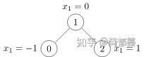

# PyG入门

## 1.简单无权图的表示



```python
import torch
from torch_geometric.data import Data

#边，shape = [2,num_edge]
edge_index = torch.tensor([[0, 1, 1, 2],
                           [1, 0, 2, 1]], dtype=torch.long)
#点，shape = [num_nodes, num_node_features]
x = torch.tensor([[-1], [0], [1]], dtype=torch.float)

data = Data(x=x, edge_index=edge_index)
>>> Data(edge_index=[2, 4], x=[3, 1])
```

## 2.数据集

PyTorch Geometric已经包含有很多常见的基准数据集，包括：

* Cora：一个根据科学论文之间相互引用关系而构建的Graph数据集合，论文分为7类：Genetic_Algorithms，Neural_Networks，Probabilistic_Methods，Reinforcement_Learning，Rule_Learning，Theory，共2708篇；
* Citeseer：一个论文之间引用信息数据集，论文分为6类：Agents、AI、DB、IR、ML和HCI，共包含3312篇论文；
* Pubmed：生物医学方面的论文搜寻以及摘要数据集。

