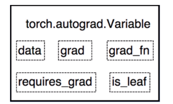
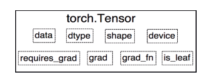
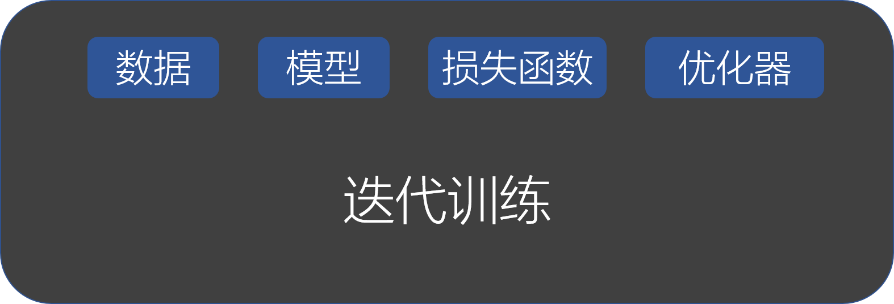
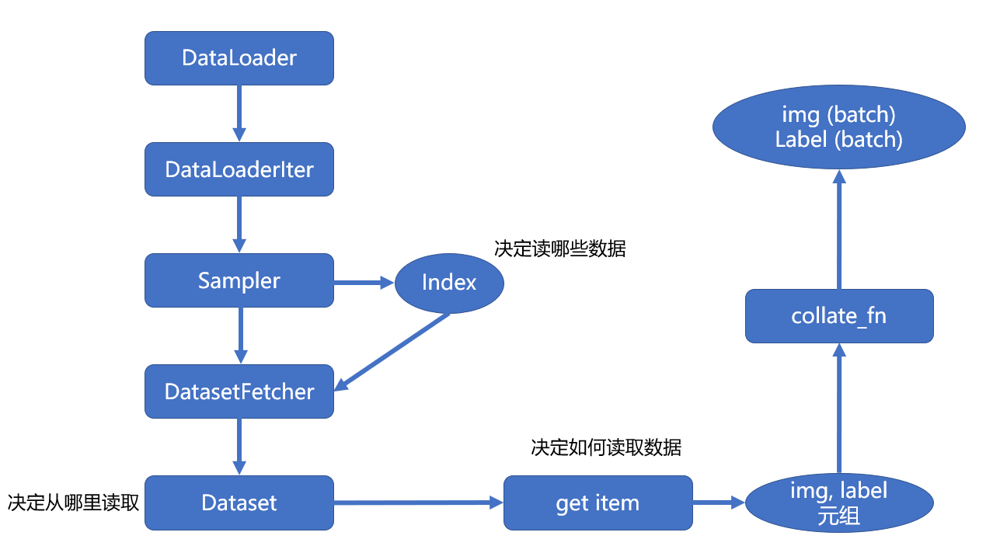
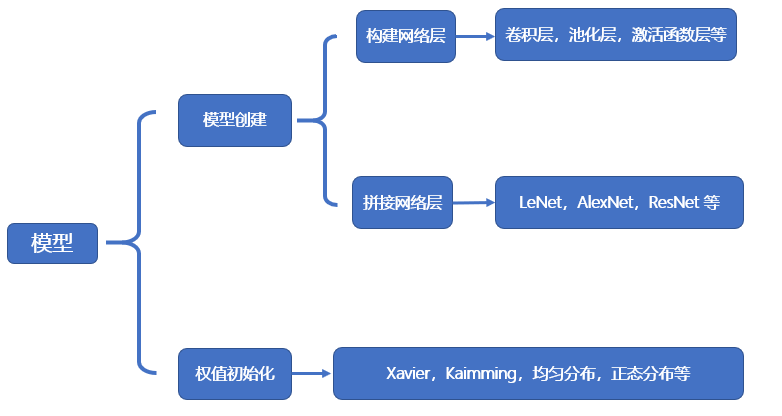
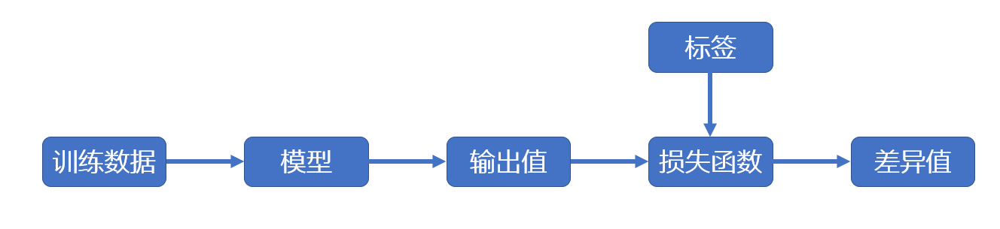
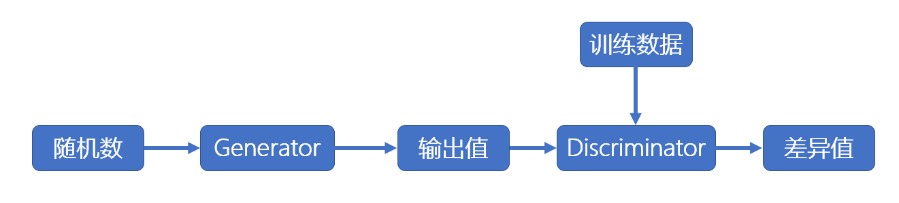

**pytorch可以说是torch的python版**

# 1.tensor（张量）





* 直接创建Tensor
* 根据数值创建Tensor
* 根据概率创建Tensor

张量的操作

* 拼接（拼接的维度发生改变；在新创建的维度上拼接，张量的维度数会发生改变）
* 切分
* 索引
* 变换
* 张量的数学运算
* 线性回归

计算图和动态图机制

* 计算图，梯度求导，叶子节点

* PyTorch的动态图机制

  PyTorch 采用的是动态图机制 (Dynamic Computational Graph)，而 Tensorflow 采用的是静态图机制 (Static Computational Graph)。

自动求导和逻辑回归

* 自动求导（torch.autograd.backward()，torch.autograd.grad() ）

  注意三点

  * 每次反向传播求导时，计算的梯度不会自动清零，所以需要手动清零，grad.zero_()
  * 依赖于叶子结点的节点，requires_grad默认为True。
  * 叶子节点不可执行inplace操作。inplace操作改变后的值和原来的值共享内存。

* 逻辑回归

  逻辑回归是线性的二分类模型。

  PyTorch实现逻辑回归

  

  * 数据：包括数据读取，数据清洗，进行数据划分和数据预处理，比如读取图片如何预处理及数据增强。
  * 模型：包括构建模块，组织复杂网络，初始化网络参数，定义网络层。
  * 损失函数：包括创建损失函数，设置损失函数超参数，根据不同任务选择合适的损失函数。
  * 优化器：包括根据梯度使用某种优化器更新参数，管理模型参数，管理多个参数组实现不同学习率，调整学习率。
  * 迭代训练：组织上面 4 个模块进行反复训练。包括观察训练效果，绘制 Loss/ Accuracy 曲线，用 TensorBoard 进行可视化分析。


# 2.图片处理与数据加载


## 2.1DataLoader和DataSet


* torch.utils.data.DataLoader()

  * Epoch: 所有训练样本都已经输入到模型中，称为一个 Epoch
  * Iteration: 一批样本输入到模型中，称为一个 Iteration
  * Batchsize: 批大小，决定一个 iteration 有多少样本，也决定了一个 Epoch 有多少个 Iteration

* torch.utils.data.Dataset

  功能：Dataset 是抽象类，所有自定义的 Dataset 都需要继承该类，并且重写`__getitem()__`方法和`__len__()`方法 。`__getitem()__`方法的作用是接收一个索引，返回索引对应的样本和标签，这是我们自己需要实现的逻辑。`__len__()`方法是返回所有样本的数量。



首先在 for 循环中遍历`DataLoader`，然后根据是否采用多进程，决定使用单进程或者多进程的`DataLoaderIter`。在`DataLoaderIter`里调用`Sampler`生成`Index`的 list，再调用`DatasetFetcher`根据`index`获取数据。在`DatasetFetcher`里会调用`Dataset`的`__getitem__()`方法获取真正的数据。这里获取的数据是一个 list，其中每个元素是 (img, label) 的元组，再使用 `collate_fn()`函数整理成一个 list，里面包含两个元素，分别是 img 和 label 的`tenser`。

## 2.2  图片预处理 transforms 模块机制

PyTorch 的数据增强

我们在安装`PyTorch`时，还安装了`torchvision`，这是一个计算机视觉工具包。有 3 个主要的模块：

* `torchvision.transforms`:  里面包括常用的图像预处理方法
  * 数据中心化
  * 数据标准化
  * 缩放
  * 裁剪
  * 旋转
  * 翻转
  * 填充
  * 噪声增加
  * 灰度变换
  * 线性变换
  * 仿射变换
  * 亮度、饱和度以及对比度变换
* `torchvision.datasets`: 里面包括常用数据集如 mnist、CIFAR-10、Image-Net 等
* `torchvision.models`: 里面包括常用的预训练好的模型，如 AlexNet、VGG、ResNet、GoogleNet 等


# 3.模型构建

## 3.1 模型创建步骤与 nn.Module




**nn.Module**


`nn.Module` 有 8 个属性，都是`OrderDict`(有序字典)。在 LeNet 的`__init__()`方法中会调用父类`nn.Module`的`__init__()`方法，创建这 8 个属性。

总结：

- 一个 module 里可包含多个子 module。比如 LeNet 是一个 Module，里面包括多个卷积层、池化层、全连接层等子 module
- 一个 module 相当于一个运算，`__init()__`实现`module`的定义， forward() 函数实现模型的整体拼接
- 每个 module 都有 8 个字典管理自己的属性

**模型容器**

除了上述的模块之外，还有一个重要的概念是模型容器 (Containers)，常用的容器有 3 个，这些容器都是继承自`nn.Module`。

* nn.Sequetial：按照顺序包装多个网络层

  顺序性：各网络层之间严格按照顺序构建，我们在构建网络时，一定要注意前后网络层之间输入和输出数据之间的形状是否匹配

  自带`forward()`函数：在`nn.Sequetial`的`forward()`函数里通过 for 循环构建网络层，执行前向传播运算。这使得我们我们构建的模型更加简洁

* nn.ModuleList：像 python 的 list 一样包装多个网络层，以迭代的方式调用网络层。

  * append()：在 ModuleList 后面添加网络层
  * extend()：拼接两个 ModuleList
  * insert()：在 ModuleList 的指定位置中插入网络层

* nn.ModuleDict：像 python 的 dict一样包装多个网络层，通过 (key, value) 的方式为每个网络层指定名称，用于包装一组网络层，以索引的方式可选择的调用网络层。

  * clear()：清空  ModuleDict
  * items()：返回可迭代的键值对 (key, value)
  * keys()：返回字典的所有 key
  * values()：返回字典的所有 value
  * pop()：返回一对键值，并从字典中删除

# 4.模型训练

## 4.1权值初始化

​		在搭建好网络模型之后，一个重要的步骤就是对网络模型中的权值进行初始化。适当的权值初始化可以加快模型的收敛，而不恰当的权值初始化可能引发梯度消失或者梯度爆炸，最终导致模型无法收敛。

## 4.2损失函数

* 损失函数：是计算**一个**样本的模型输出与真实标签的差异。
  * nn.CrossEntropyLoss：交叉熵
  * nn.NLLLoss：实现负对数似然函数中的符号功能
  * nn.BCELoss：计算二分类的交叉熵。需要注意的是：输出值区间为 [0,1]。
  * nn.BCEWithLogitsLoss：结合 sigmoid 与二分类交叉熵。
  * nn.L1Loss：计算 inputs 与 target 之差的绝对值
  * nn.MSELoss：计算 inputs 与 target 之差的平方
  * nn.SmoothL1Loss：平滑的 L1Loss
  * nn.PoissonNLLLoss：泊松分布的负对数似然损失函数
  * nn.KLDivLoss：计算 KLD(divergence)，KL 散度，相对熵
  * nn.MarginRankingLoss：计算两个向量之间的相似度，用于排序任务
  * nn.MultiLabelMarginLoss：多标签边界损失函数
  * nn.TripletMarginLoss：计算三元组损失，人脸验证中常用
  * nn.CosineEmbeddingLoss：采用余弦相似度计算两个输入的相似性
* 代价函数：代价函数(Cost Function)是计算**整个样本集**的模型输出与真实标签的差异，是所有样本损失函数的平均值。
* 目标函数：代价函数加上正则项。

## 4.3优化器

PyTorch 中的优化器是用于管理并更新模型中可学习参数的值，使得模型输出更加接近真实标签。

**optimizer的属性**

* defaults：优化器的超参数，如 weight_decay，momentum
* state：参数的缓存，如 momentum 中需要用到前几次的梯度，就缓存在这个变量中
* param_groups：管理的参数组，是一个 list，其中每个元素是字典，包括 momentum、lr、weight_decay、params 等。
* _step_count：记录更新 次数，在学习率调整中使用

**optimizer的方法**

* zero_grad()：清空所管理参数的梯度。由于 PyTorch 的特性是张量的梯度不自动清零，因此每次反向传播之后都需要手动清空梯度。
* step()：执行一步梯度更新
* add_param_group()：添加参数组
* state_dict()：获取优化器当前状态信息字典
* load_state_dict()：加载状态信息字典，包括 state 、momentum_buffer 和 param_groups。主要用于模型的断点续训练。我们可以在每隔 50 个 epoch 就保存模型的 state_dict 到硬盘，在意外终止训练时，可以继续加载上次保存的状态，继续训练。

**学习率**

学习率是影响损失函数收敛的重要因素，控制了梯度下降更新的步伐。

**momentum 动量**

**PyTroch 提供的 10 种优化器**

* optim.SGD()：随机梯度下降法
* optim.Adagrad(): 自适应学习率梯度下降法
* optim.Adam(): RMSProp 集合 Momentum，这个是目前最常用的优化器，因为它可以使用较大的初始学习率。


# 5.可视化和hook

## 5.1 TensorBoard介绍

TensorBoard 是 TensorFlow 中强大的可视化工具，支持标量、文本、图像、音频、视频和 Embedding 等多种数据可视化。

在 PyTorch 中也可以使用 TensorBoard，具体是使用 TensorboardX 来调用 TensorBoard。除了安装 TensorboardX，还要安装 TensorFlow 和 TensorBoard，其中 TensorFlow 和 TensorBoard 需要一致。

TensorBoardX 可视化的流程需要首先编写 Python 代码把需要可视化的数据保存到 event file 文件中，然后再使用 TensorBoardX 读取 event file 展示到网页中。

主要关注的是保存 event file 需要用到 SummaryWriter 类，这个类是用于保存数据的最重要的类，执行完后，会在当前文件夹生成一个`runs`的文件夹，里面保存的就是数据的 event file。然后在命令行中输入`tensorboard --logdir=lesson5/runs`启动 tensorboard 服务，其中`lesson5/runs`是`runs`文件夹的路径。然后命令行会显示 tensorboard 的访问地址，在浏览器中打开。

**SummaryWriter**

功能：提供创建 event file 的高级接口

`torch.utils.tensorboard.writer.SummaryWriter(log_dir=None, comment='', purge_step=None, max_queue=10, flush_secs=120, filename_suffix='')`

* add_scalar（）：记录标量，一条曲线
* add_scalars（）：在一张图中记录多条曲线
* add_histogram（）：统计直方图与多分位折线图

**模型指标监控**

使用 TensorBoard 来监控人民币二分类实验训练过程中的 loss、accuracy、weights 和 gradients 的变化情况。

首先定义一个`SummaryWriter`。然后在每次训练中记录loss、accuracy，并且在验证时记录所有验证集样本的 loss 和 accuracy 的均值，并且在每个 epoch 中记录每一层权值以及权值的梯度。


add_image（）：记录图像。

torchvision.utils.make_grid（）：制作网格图像。

## 5.2HOOK函数和CAM函数

由于 PyTorch 是基于动态图实现的，因此在一次迭代运算结束后，一些中间变量如非叶子节点的梯度和特征图，会被释放掉。在这种情况下想要提取和记录这些中间变量，就需要使用 Hook 函数。

* torch.Tensor.register_hook(hook)：注册一个反向传播 hook 函数，输入的参数是张量的梯度。
* torch.nn.Module.register_forward_hook(hook)：注册 module 的前向传播`hook`函数，可用于获取中间的 feature map。
* torch.Tensor.register_forward_pre_hook()：注册 module 的前向传播前的`hook`函数，可用于获取输入数据。
* torch.Tensor.register_backward_hook()：注册 module 的反向传播的`hook`函数，可用于获取梯度。

**`hook`函数实现机制**

`hook`函数实现的原理是在`module`的`__call()__`函数进行拦截，`__call()__`函数可以分为 4 个部分：

* 第 1 部分是实现 _forward_pre_hooks
* 第 2 部分是实现 forward 前向传播 
* 第 3 部分是实现 _forward_hooks  
* 第 4 部分是实现 _backward_hooks

**CAM(class activation map, 类激活图)**

# 6.正则化

## 6.1权重衰减和dropout

**regularization**

Regularization 中文是正则化，可以理解为一种减少方差的策略。在机器学习中，误差可以分解为：偏差，方差与噪声之和。即误差=偏差+方差+噪声。偏差度量了学习算法的期望预测与真实结果的偏离程度，即刻画了学习算法本身的拟合能力。方差度量了同样大小的训练集的变动所导致的学习性能的变化，即刻画了数据扰动所造成的影响。噪声则表达了在当前任务上学习任何算法所能达到的期望泛化误差的下界。

**Dropout**

Dropout 是另一种抑制过拟合的方法。在使用 dropout 时，数据尺度会发生变化。PyTorch中，通常放在每个网络层的最前面。

**model.eval() 和 model.trian()**

有些网络层在训练状态和测试状态是不一样的，如 dropout 层，在训练时 dropout 层是有效的，但是数据尺度会缩放，为了保持数据尺度不变，所有的权重需要除以 1-p。而在测试时 dropout 层是关闭的。

因此在测试时需要先调用`model.eval()`设置各个网络层的的`training`属性为 False，在训练时需要先调用`model.train()`设置各个网络层的的`training`属性为 True。

## 6.2 Normalization

**Batch Normalization**

称为批标准化。批是指一批数据，通常为 mini-batch；标准化是处理后的数据服从标准正态分布。

批标准化的优点有如下：

* 可以使用更大的学习率，加速模型收敛
* 可以不用精心设计权值初始化
* 可以不用 dropout 或者较小的 dropout
* 可以不用 L2 或者较小的 weight decay
* 可以不用 LRN (local response normalization)

**Batch Normalization in PyTorch**

* nn.BatchNorm1d()
* nn.BatchNorm2d()
* nn.BatchNorm3d()

# 7.模型的其他操作

## 7.1 模型保存和加载

**序列化与反序列化**

模型在内存中是以对象的逻辑结构保存的，但是在硬盘中是以二进制流的方式保存的。

* 序列化是指将内存中的数据以二进制序列的方式保存到硬盘中。PyTorch 的模型保存就是序列化。
* 反序列化是指将硬盘中的二进制序列加载到内存中，得到模型的对象。PyTorch 的模型加载就是反序列化。

**PyTorch 中的模型保存与加载**

torch.save()

* 保存整个 Module:`torch.savev(net, path)`

* 只保存模型的参数:

  ```state_sict = net.state_dict()```

  ```torch.savev(state_sict, path)```

torch.load()

* 加载整个 Module:
* 只加载模型的参数：这种方法需要事先创建一个模型对象，再使用模型的`load_state_dict()`方法把参数加载到模型中。

**模型的断点续训练**

在训练过程中，可能由于某种意外原因如断点等导致训练终止，这时需要重新开始训练。断点续练是在训练过程中每隔一定次数的 epoch 就保存**模型的参数和优化器的参数**，这样如果意外终止训练了，下次就可以重新加载最新的**模型参数和优化器的参数**，在这个基础上继续训练。

## 7.2 模型Finetune（微调）

## **7.3 使用 GPU 训练模型**

在数据运算时，两个数据进行运算，那么它们必须同时存放在同一个设备，要么同时是 CPU，要么同时是 GPU。而且数据和模型都要在同一个设备上。数据和模型可以使用`to()`方法从一个设备转移到另一个设备。而数据的`to()`方法还可以转换数据类型。

**tensor.to()` 和 `module.to()**

`tensor`和`module`的 `to()`方法的区别是：`tensor.to()`执行的不是 inplace 操作，因此需要赋值；`module.to()`执行的是 inplace 操作。

**`torch.cuda`常用方法**

* torch.cuda.device_count()：返回当前可见可用的 GPU 数量
* torch.cuda.get_device_name()：获取 GPU 名称
* torch.cuda.manual_seed()：为当前 GPU 设置随机种子
* torch.cuda.manual_seed_all()：为所有可见 GPU 设置随机种子
* os.environ.setdefault("CUDA_VISIBLE_DEVICES", "2", "3")：设置可见 GPU的编号

**多 GPU 的分发并行**

`torch.nn.DataParallel(module, device_ids=None, output_device=None, dim=0)`

包装模型，实现分发并行机制。

**提高 GPU 的利用率**

`nvidia-smi`命令查看可以 GPU 的利用率。`Memory Usage`表示显存的使用率，`Volatile GPU-Util`表示计算 GPU 实际运算能力的利用率。

虽然使用 GPU 可以加速训练模型，但是如果GPU 的 `Memory Usage` 和 `Volatile GPU-Util` 太低，表示并没有充分利用 GPU。因此，使用 GPU 训练模型，需要尽量提高 GPU 的 `Memory Usage` 和 `Volatile GPU-Util` 这两个指标，可以更进一步加速你的训练过程。

* Memory Usage：主要调整的是每个 batch 训练的数据量的大小，也就是 **batch_size**。

  在模型结构固定的情况下，尽量将`batch size`设置得比较大，充分利用 GPU 的内存。但是也要考虑模型的效果。

* Volatile GPU-Util：GPU 运算单元的使用率。

# 8.实际应用

## 8.1 **图像分类简述与 ResNet 源码分析**

## 8.2 **目标检测简介**

目标检测是判断目标在图像中的位置。

目标检测模型可以划分为 one-stage 和 two-stage。

one-stage 模型是直接把得到的特征图划分为多个网格，每个网格分别做分类和回归。包括：

* YOLO
* SSD
* Retina-Net

two-stage 的模型多了 proposal generation，输出多个候选框，包括：

* RCNN
* SPPNet
* Fast RCNN
* Faster RCNN
* Pyramid Network

## 8.3**GAN（生成对抗网络）简介**

GAN 可以看作是一种可以生成特定分布数据的模型。

**GAN 的训练和监督学习训练模式的差异**

在监督学习的训练模式中，训练数经过模型得到输出值，然后使用损失函数计算输出值与标签之间的差异，根据差异值进行反向传播，更新模型的参数，如下图所示。



在 GAN 的训练模式中，Generator 接收随机数得到输出值，目标是让输出值的分布与训练数据的分布接近，但是这里不是使用人为定义的损失函数来计算输出值与训练数据分布之间的差异，而是使用 Discriminator 来计算这个差异。需要注意的是这个差异不是单个数字上的差异，而是分布上的差异。如下图所示。



总结:有监督学习是为了让值更接近，而生成对抗网络是为了让分布更接近。

# 9.PyTorch常见报错汇总

# 10.**图神经网络 PyTorch Geometric 入门教程**

PyTorch Geometric Library (简称 PyG) 是一个基于 PyTorch 的图神经网络库，地址是：https://github.com/rusty1s/pytorch_geometric。它包含了很多 GNN 相关论文中的方法实现和常用数据集，并且提供了简单易用的接口来生成图，因此对于复现论文来说也是相当方便。用法大多数和 PyTorch 很相近，因此熟悉 PyTorch 的同学使用这个库可以很快上手。


