# **HOW POWERFUL ARE GRAPH NEURAL NETWORKS?**

ICLR2019

* 第一篇分析GNN表达能力的文章，根据WL test建立了GNN表达能力的分析框架
* 聚合函数和读出函数满足单射的GNN的表达能力就强于GCN，确保了一一对应。
* 结构是“星型”的，只利用了中心节点和邻居节点之间直接相连信息，没有利用邻居节点之间相互连接的信息。

# **A NEW PERSPECTIVE ON "HOW GRAPH NEURAL NETWORKS GO BEYOND WEISFEILER-LEHMAN?"**

ICLR2022

* 基于子图，提出了重叠子图的概念
* 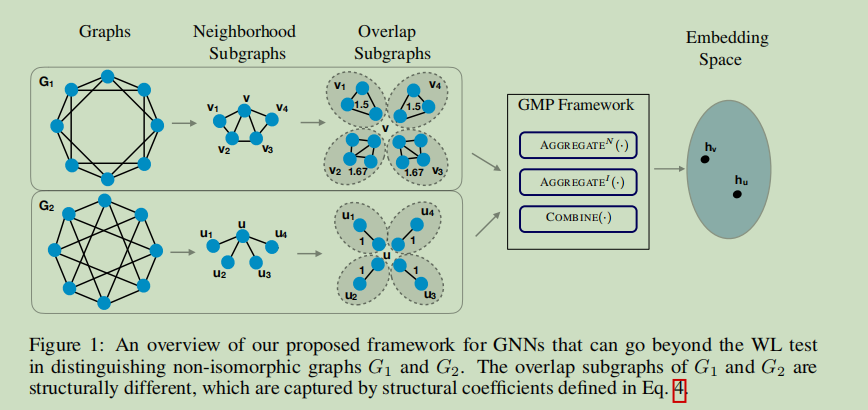
* 重叠子图的构造策略：选取中心节点和一个邻居节点，找到同时和中心节点和邻居节点相连的节点，所有这样的节点和中心节点、邻居节点诱导的子图就是重叠子图。
* 与中心节点相连说明该节点是中心节点的邻居，与邻居节点相连说明该节点与邻居节点之间存在边，综合上述两个条件，重叠子图描述的就是邻居节点与多少其他邻居节点相连，从而衡量邻居节点和其他邻居节点的连接紧密程度

* 从消息传递的角度，结构系数w衡量的是在重叠子图中，邻居节点和其他邻居节点连接的紧密程度。这样就将邻居节点与邻居节点之间连接的信息融入到了消息传递的过程中。结构系数w控制邻居节点向中心节点传递信息的多少。（结构系数越大，邻居节点与其他邻居节点连接的越多，该节点向中心节点传递的信息的权重越大，传递的信息越多）
* 重叠子图的构造和结构系数的计算都在预处理中，训练过程没有增加额外的时间成本。
* 为什么一定要是**重叠**子图？对于这篇论文来说，如果不重叠，那么就存在邻居节点之间连接信息被一方占有的情况。这也是我下面想法的一个很大的缺点，在一般情况下，很难将邻居节点划分成多个互不相连，完全独立的子图，如果可能的话，子图也会因为要满足不丢失邻居节点之间连接的信息而变得很大。

# **EQUIVARIANT SUBGRAPH AGGREGATION NETWORKS**

ICLR2022

* 主要思路：虽然两个图可能不能被一个MPNN所区分，但它们通常包含可区分的子图。因此，可以将每个图表示为由某个预定义策略导出的**子图集**，并使用合适的**等变架构**对其进行处理。
* 提出了1-WL test的新变体
* 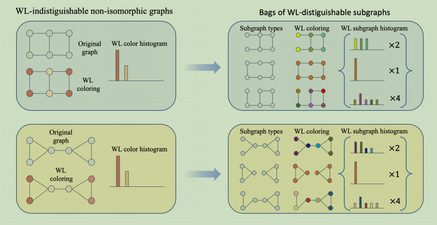

* 上图中，左边的方法无法区分两个图。右边的方法，通过删除图中的边构造出子图袋，可以区分两个图

# **Nested Graph Neural Networks**

NIPS2021

* 简单粗暴，直接用子图来增强节点的表示。跟我最初的想法很类似，我之前就是卡在如何学习子图的表示，这篇论文用的方法就是使用GNN得到子图中每个节点的表示，然后通过子图池化函数得到子图的表示。
* NGNN在每个节点周围提取一个局部子图，并对每个子图应用一个基GNN来学习一个子图的表示。然后通过聚合子图表示来得到全图表示。
* 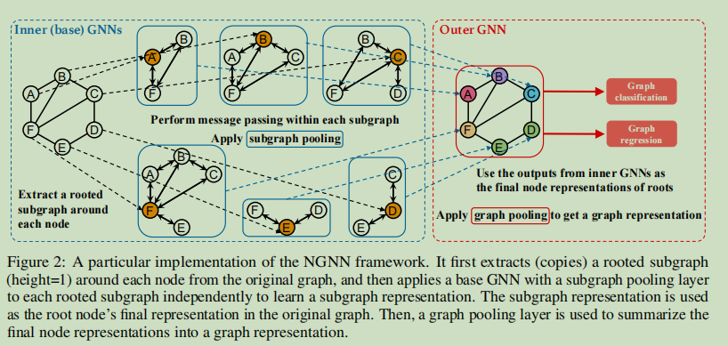
* NGNN包括两个GNN:inner-GNN(base GNN)和outer-GNN。
  * inner-GNN：首先直接将邻域构成的子图作为中心节点的子图，使用inner-GNN在子图上训练，得到子图中每个节点的表示，然后使用子图池化函数，得到一个子图表示，然后将子图的表示作为中心节点的表示。
  * outer-GNN：得到图中每个节点的表示（子图的表示）后，然后使用图池化函数，得到整个图的表示。
* 这种方法就比较简单粗暴，代价就是增加了训练的时间成本，大概是GCN的两倍。

# **FROM STARS TO SUBGRAPHS: UPLIFTING ANY GNN WITH LOCAL STRUCTURE AWARENESS**

ICLR2022

* 思路与Nested Graph Neural Networks差不多
* 将MPNN中的局部聚合从星型模式扩展到一般的子图模式。
* 选择GNN作为子图编码器，即NGNN的inner-GNN，用神经网络替换内核。

# YOU ARE ALLSET: A MULTISET LEARNING FRAMEWORK FOR HYPERGRAPH NEURAL NETWORKS

ICLR2022

* 超图：普通的图的边只能连接两个节点，但是超图中的超边可以连接多个节点。论文中给出的例子是论文的多个作者就是用一个超边连接的多个节点。
* 提出一种新的超图神经网络范式。
* 主要思路：抛弃之前的将超图增广成普通的图的做法，将超边连接的多个节点作为一个多重集（这也是题目you are allset的含义）。使用两个多集函数实现了超图神经网络层。
* 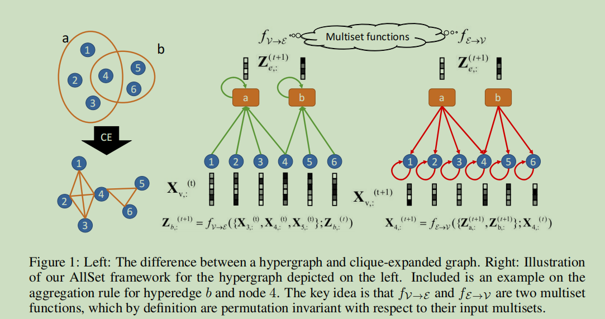
* 上图中有个小错误。在中间的图中，应该是节点4、5、6向超边b传递信息，而不是节点3、4、5。应该是笔误。
* 论文中提到，这是第一次将GNN拓展到超图上，MPNN是超图GNN的特例。
* **（直观感觉）**选择这篇论文的原因：其实我下面说的想法，感觉跟超图还有点关系。对照上图，超边可以看成是中心节点，超边连接的多个节点就可以看成是中心节点的邻居节点。**因为超边连接多个节点，是不是可以看成是超边要和这多个节点都相连？**这样的话，把超边看成一个虚拟节点，超边连接多个节点，是不是就能看成是一个虚拟的中心节点有多个邻居？主要的区别就是，超边连接的多个节点没有相互连接的关系，而邻居节点之间存在相互连接的关系。

# 一点想法

上述的研究GNN表达能力的论文都是基于子图结构的，希望通过使用比节点更大的图结构增强GNN的表达能力。因为一般GNN只对邻居节点进行聚合，只考虑了中心节点和邻居节点的连接信息，没有考虑邻居节点之间的连接关系，这就“丢失”了**邻居节点相互连接的信息**。

WL test基于的是多重集，但是这里的多重集是指节点的多重集，即只聚合邻居节点，同样丢失邻居节点之间的连接关系。上述基于子图的研究就是考虑增加邻居节点之间的连接关系这部分信息。

ICLR2022的重叠子图很巧妙，不使用邻域直接作为子图，而是构造重叠子图，将邻居节点之间的连接关系加到聚合过程中 。具体做法就是为中心节点和每一个邻居节点生成重叠子图，计算结构系数作为连接中心节点和邻居节点的边的权重，这个权重描述了邻居节点向中心节点传递信息的多少。

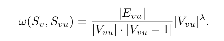

* 结构系数的计算只用到了节点数和边数，还是存在缺陷。相同的节点数和边数构成的重叠子图，也可能会有不同的结构。**小想法：**能不能再加点其他的属性到计算过程中，比如节点的度？

NIPS2021的NGNN的处理方法更加粗暴，一阶邻域直接作为子图，使用GNN作为base-GNN。基于消息传递机制，每个节点都从邻居节点聚合信息，最后通过池化获得子图表示作为中心节点的表示。（至于为什么子图的表示比节点表示表达能力更强，原论文说的也不是很详细。原论文认为表达能力增强的原因是池化，也就是聚合了所有节点表示得到的子图表示在一定程度上包含了邻居之间的连接关系）

上述工作的都是考虑了邻居之间的连接关系，如果我们的方法也能使用上这部分信息，直观上，GNN的表达能力也能得到增强。

是不是能基于子图对多重集进行拓展？

对WL test的多重集进行改进：节点的多重集->节点的多重集+子图的多重集。

对于子图多重集的构造策略，其实可以有很大的扩展性。

比如，我们可以要求子图中两两节点相连，从而构造出一个”紧密“的子图，或者只要求节点至少和子图中的一个节点相连，从而构造出一个”稀疏“的子图。**这种子图构造策略的缺点：**

* **不重叠**，不重叠就可能会造成连接信息的丢失。（重叠的话，我不确定这种子图构造策略和重叠子图构造策略的区分度）
* **可能得不到足够多的子图多重集，而是多个很大的子图**。（因为我们要考虑的是一般情形的数据，所以必须保证这种子图构造方法在一般图数据上能很好的工作，但是，今天金弟老师的讲座给了我一点启发， 我们可以寻找一种特殊的应用场景下的图数据，中心节点的邻居节点可以很好的分成多个互不连通的小的子图）
* * **策略太严格**，要求子图中两两节点相连，得到全连接子图，就会导致有些邻居无法满足节点两两相连从而被”丢弃“。
  * **策略太宽松**，只要求节点至少和子图中的一个节点相连，得到一个”稀疏“的子图，可能会得到几个很大的子图，极端情况下，在子图中两两邻居节点之间都可到达，那么就会只得到一个所有邻居节点构成的子图。

下面的图的子图构造策略，就是要求节点至少和子图中的一个节点相连。

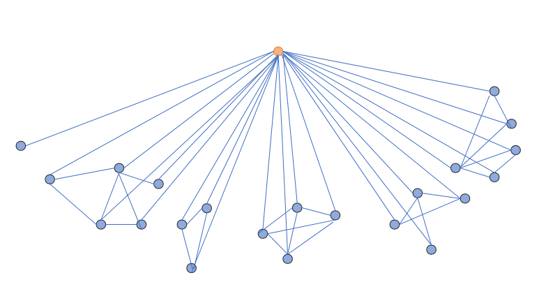

下图是删掉中心节点和邻居节点的边后的图，更加形象。

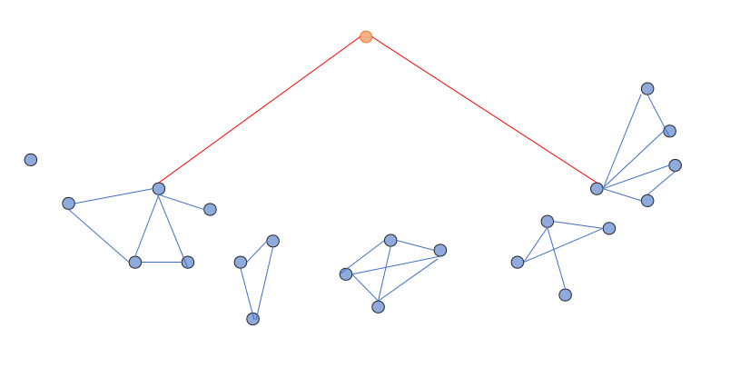

当然，上面的图是一种理想的情况，我们希望得到的是这样的结构。

下面的图，就说明了这种子图构造策略的缺点。

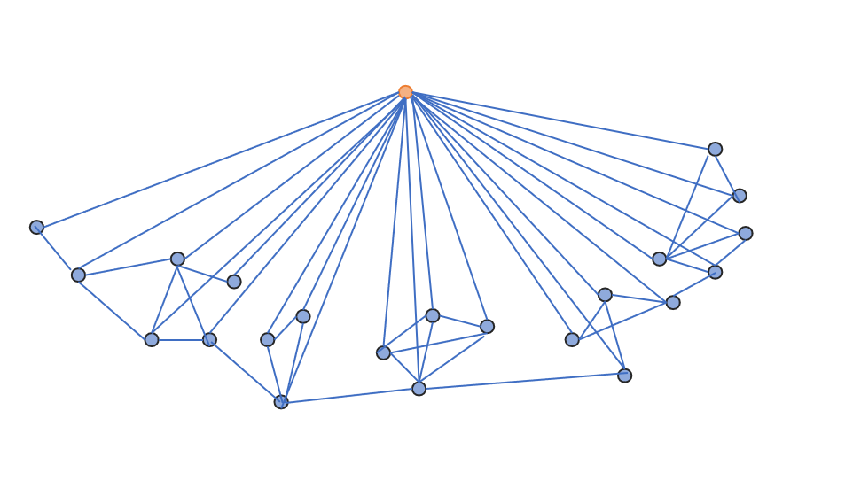

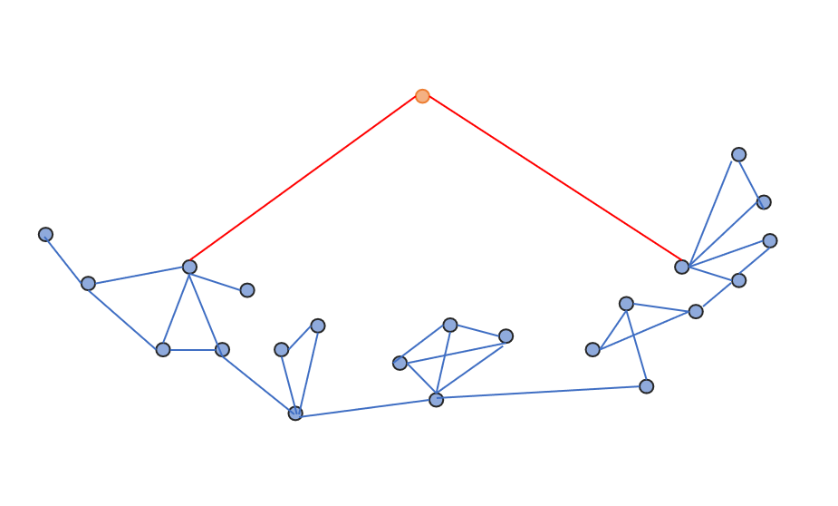

对于这个图，子图构造策略得到的子图就是一个很大的子图。

反过来想，重叠子图的构造策略可以进一步简化成邻居节点和与相连的其他邻居节点构成的子图，跟上面说的子图构造策略的一个很大的不同点是：**存在一个”中心“节点**，即那个邻居节点，只要求邻居节点跟“中心”节点相连即可，属于最宽松的要求。上面说的那种子图构造策略是**存在一个节点的集合，而不是一个中心节点**，即满足连接限制的邻居节点的集合。

**起初，我是想避开重叠，在不重叠的基础上想一种子图构造策略，但是到现在，为了不丢失信息，子图构造策略又必须要保证重叠。**

**重叠**可以解决这个问题，但是为每一个邻居构造子图，这种方法就跟**重叠子图**的方法很像了，**是不是有足够的区分度？**

在保证重叠的前提下，打算把子图集和节点集的想法应用到子图上。

# 本周进展

**idea方面**

* 思考了重叠子图不能区分的情况，如下图，计算出的结构系数相同，即红色边的权重相同。原因是结构系数的计算方法。结构系数的计算只用到了节点数和边数，没有考虑相同的节点数和边数也会构成不同的拓朴结构。可以考虑把一些其他信息，比如节点的度，加入到计算过程中。

  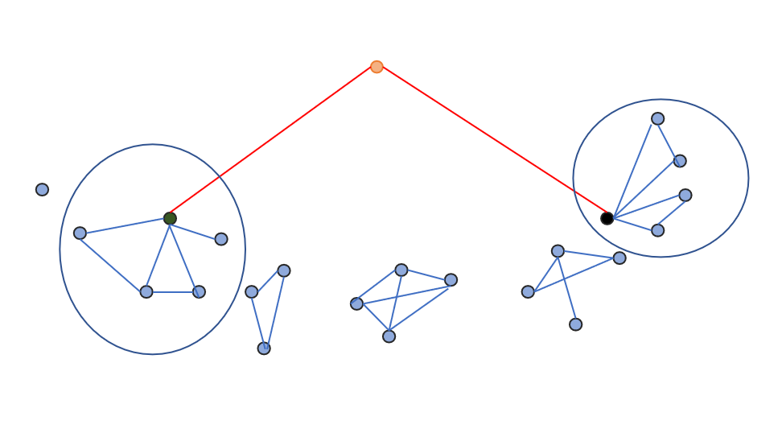

* 为了不丢失邻居节点之间的连接信息，**重叠**是必须的。

* 思考了自己子图构造策略的缺点，邻居之间的连接信息会丢失，重叠可以解决，**但是这样的话，跟重叠子图的构造方法是否有足够的区分度？**

* 在保证重叠的前提下，打算把子图集和节点集的想法应用到子图上，见下图，图中深色节点表示“中心邻居节点”。学习重叠子图，生成一个“中心邻居节点”，然后对“中心邻居节点”生成子图集和节点集。(套娃，最底层应该是互不相连的)

  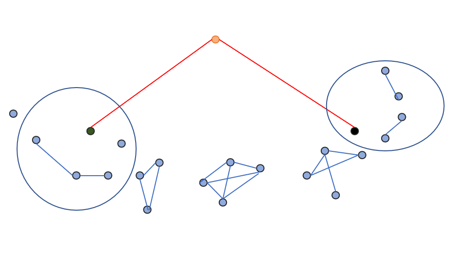

* 重新思考了重叠子图的构造策略，**存在一个”中心“节点**，即那个邻居节点，只要求其他邻居节点跟“中心”节点相连即可，属于**最宽松**的要求，因此构造的子图也是最大的。

**实验方面**

这周其实大部分时间是在看重叠子图的代码和学习代码中一些库的使用，基本都是现用现查现看和写注释，这部分没留下什么文字总结，以后做总结。

