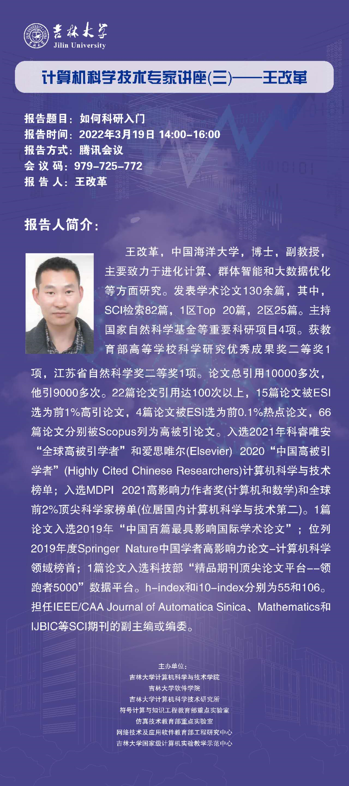
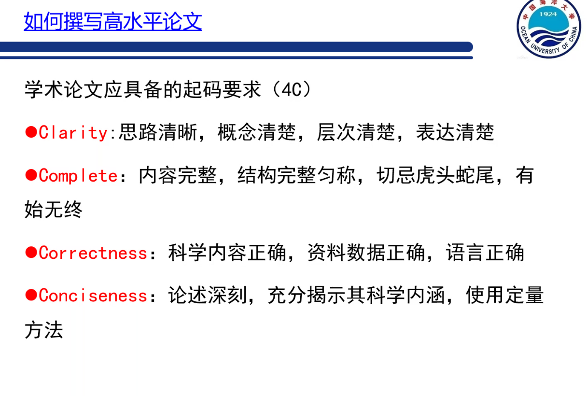
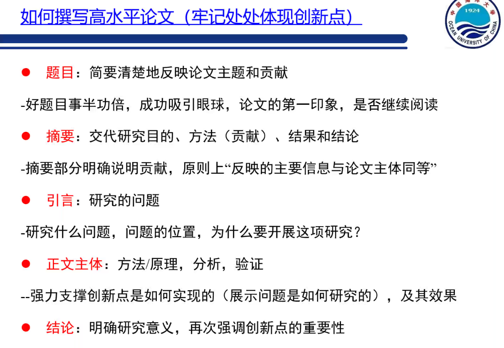
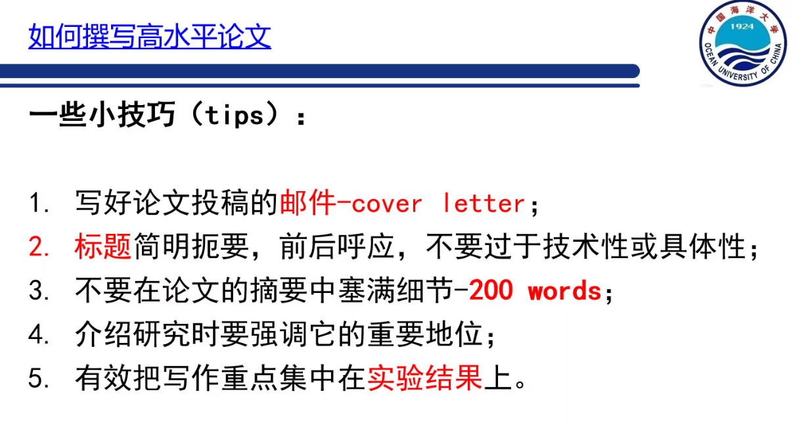
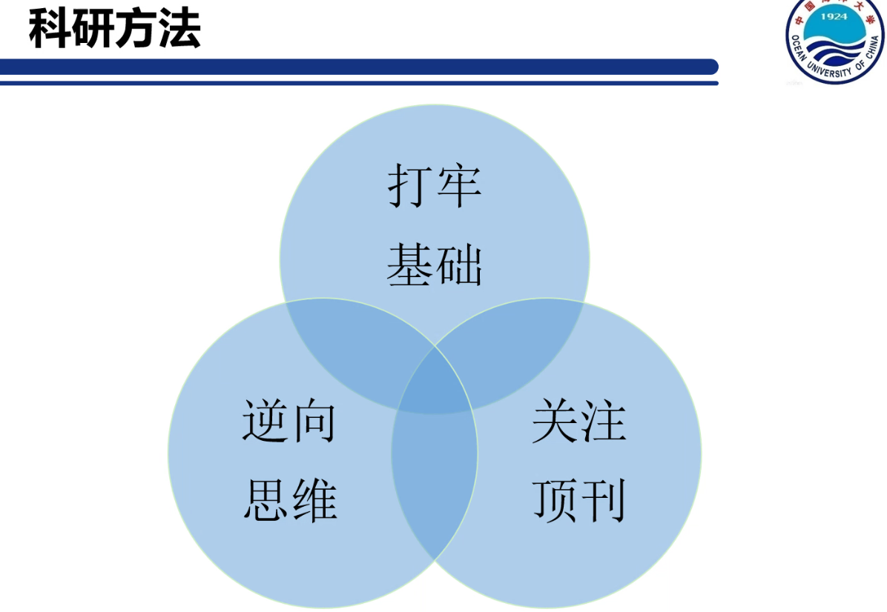
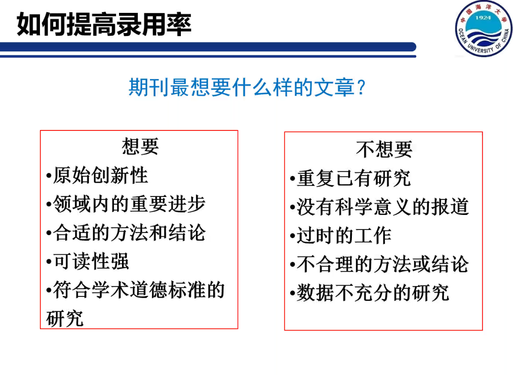
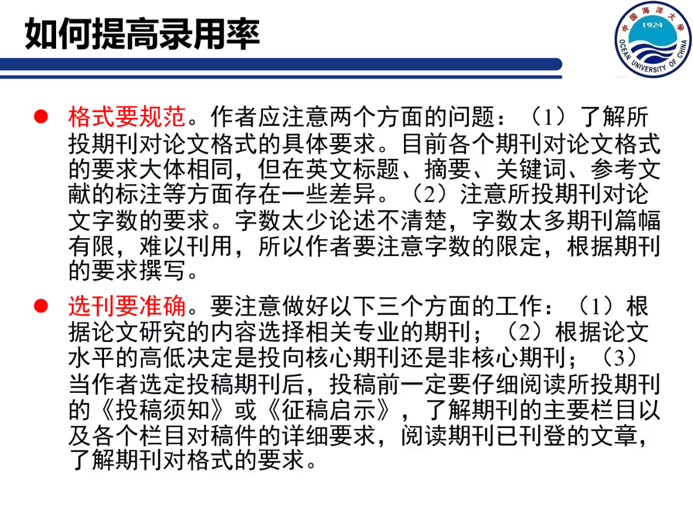
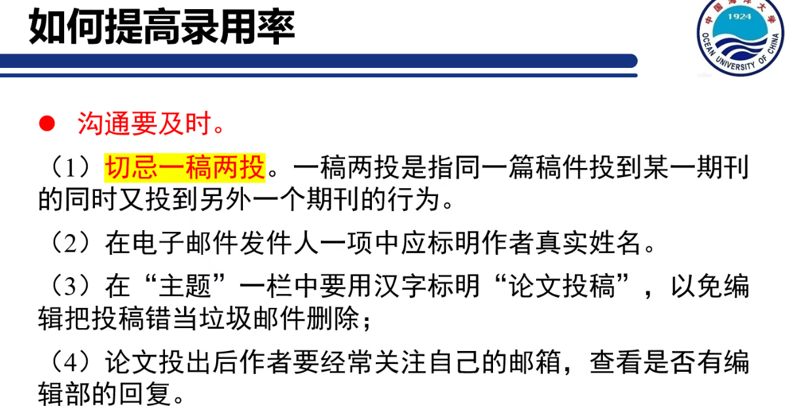
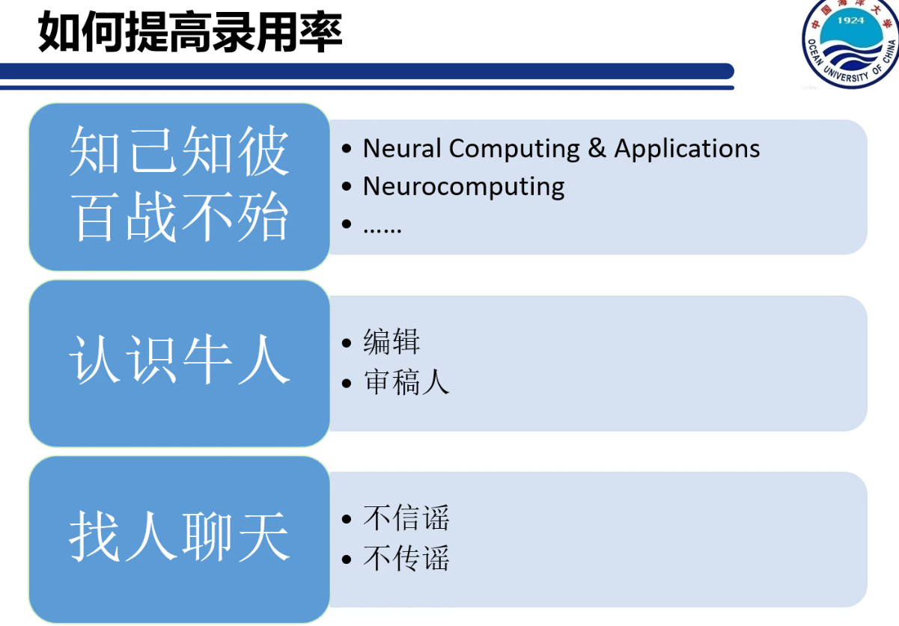
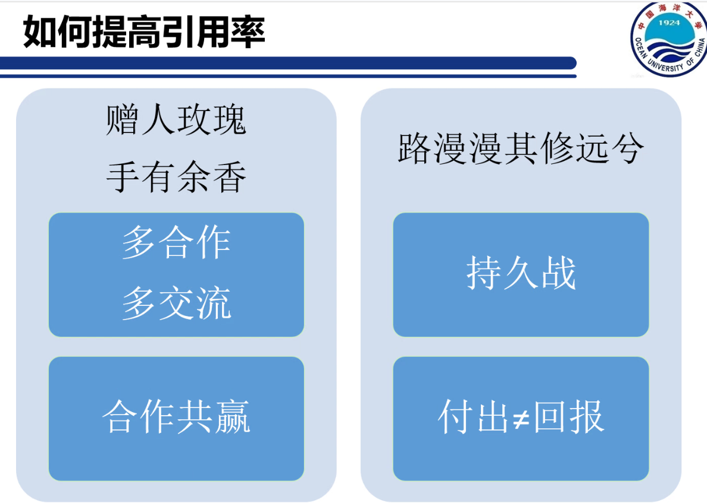

# 科研入门

中国海洋大学-王改革

## 1.web of science

只收录SCI检索、EI检索。小而精

## 2.谷歌学术

新，及时

## 3.scopus

对标web of science。大而全。

会做科研！=会写论文

**打牢基础**

* 数学要好，计算机问题经过多次建模都能变成纯数学问题

* 英语要好，最新成果都是英文发表
* 编程能力，会写代码

**关注顶刊**

* 顶刊，顶会

**逆向思维**

* 有idea，就要去实验验证，然后反馈纠正。

**原始创新型（前期调研）：去谷歌学术上调研，是否有人已经做过**

**领域内的重要进步：跟踪领域内的顶刊顶会**

**最好使用单位邮箱，坚决不用QQ邮箱**

**付出！=汇报，但是 付出=收获**

**输入，思考，整理，输出**

* 智能计算：也称为计算智能，智能计算就是借用自然界生物界规律的启迪根据其原理模仿设计求解问题的算法。包括遗传算法、进化算法、人工智能、神经网络、知识发现、模式识别、数据挖掘。